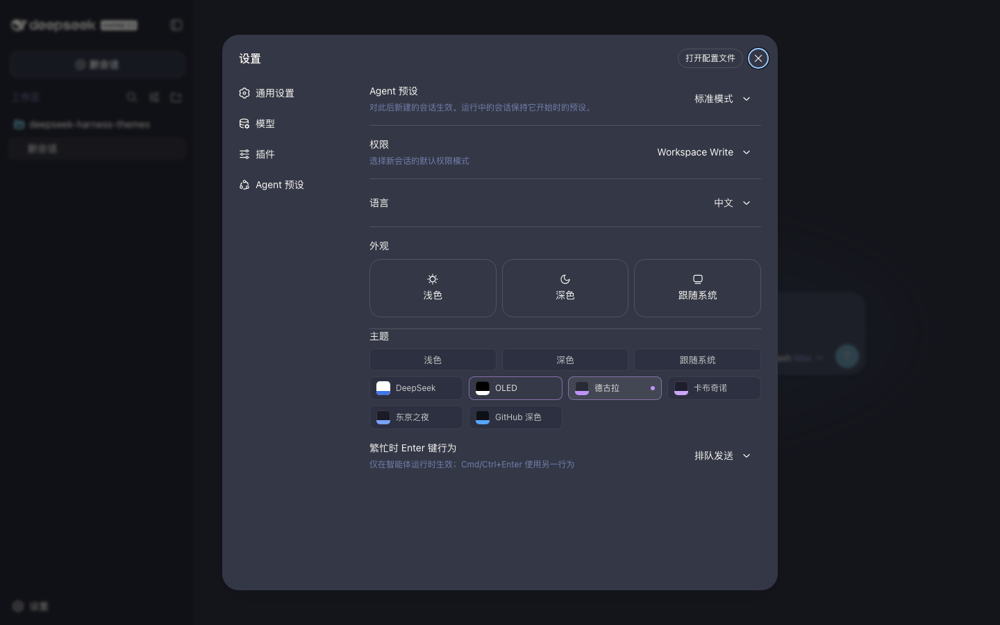

# 安装指南

[English](installation.md) | [简体中文](installation.zh.md)

两种安装形态：完整选择器插件（主题 + 设置行 + 持久化），或仅核心包（供自带选择 UI 的组合使用）。

## 快速开始

```sh
dsh plugin --profile web add @dshthemes/ui
dsh web
```

十一个主题的外观见[主题预览](previews.zh.md)。

打开 设置 → General：Theme 行紧跟在宿主 Appearance 行之后。内置三立方块（Light / Dark / System）与宿主行为完全一致；其余条目切换到已注册主题。第三方选择持久化在 `dsh-themes` 设置命名空间，因此之后换主题只是浏览器偏好，不再需要任何命令。



## 前置条件

- 带有 Web 界面（`dsh-web-app` 组合）的 deepseek-harness，主题是浏览器客户端插件。
- pnpm 在 `PATH` 上：`dsh plugin` 会把参数转发给 profile 目录下的 pnpm。执行 `corepack enable` 即可。
- 没有别的了。cordis、schemastery、React 与客户端运行时由 harness 经 loader 模块表和 `$DSH_HOME/profiles/node_modules` 兜底目录提供，主题目录又已内联进选择器 bundle，因此 profile 只装一个包、不装任何伴生包。
- 一个用于安装的 profile。profile 位于 `$DSH_HOME/profiles/<name>`（`$DSH_HOME` 默认 `~/.dsh`），`web` 是随包的 Web profile，首次使用时自动初始化。`--profile` 为必填且没有默认值，因此本文所有命令都显式写 `web`；若你自建了 profile，替换成它的名字即可，但要记得自建 profile 只带 `@deepseek-ai/dsh-base`，Web 应用层需要你自己加。

## 完整插件：`@dshthemes/ui`

本包随带 bundle manifest，一条命令完成依赖安装、profile bundle 列表的层添加与功能挂载：

```sh
dsh plugin --profile web add @dshthemes/ui
```

无需手工编辑 `cordis.patch.yml` —— `dsh plugin` 会按已安装状态校准 `dsh.profile.bundles`。升级与卸载走同一条路径：

```sh
dsh plugin --profile web update @dshthemes/ui
dsh plugin --profile web remove @dshthemes/ui
```

偏好手写层的 profile 可以使用等价的 patch 行：

```yaml
# $DSH_HOME/profiles/web/cordis.patch.yml
- insert:
    - id: dsh-themes
      name: "@dshthemes/ui"
```

这一行是 `dsh plugin` 的替代方案，而不是它的补充：在 profile 目录里直接 `pnpm add` 只会装上包、不会校准 bundle 列表，此时挂载功能的正是这行手写 patch。

选择器 bundle 已内联核心主题库，因此无需 core 行 —— 一行挂载整个功能。

## 仅核心包：`@dshthemes/core`

只要主题不要选择器的组合（自制选择界面、斜杠命令、或部署期固定主题），安装 core bundle 后以编程方式选择：

```sh
dsh plugin --profile web add @dshthemes/core
```

```ts
// 在 core 入口之后加载的任意客户端插件中：
ctx.effect(() => {
  ctx.theme.setTheme("catppuccin");
}, "deployment: fixed theme");
```

两个包互为替代。它们注册同一批十一个主题 id，而宿主注册表对重复 id 抛错，因此一个 profile 只能挂载选择器行或 core 行之一，不能同时挂载。

core 包还导出 `registerThemes(registry)` 与全部主题定义，供完全自定义的组装使用。

## 源码安装

`dsh plugin` 会把路径、`link:` 与 tarball 规范转发给 pnpm，并按已安装包的真实包名校准 bundle 列表，因此一个检出的挂载方式与 registry 安装完全一致 —— 同样不需要手写 patch 行。`lib/` 是构建产物，所以先构建检出：

```sh
git clone https://github.com/orxz/deepseek-harness-themes
cd deepseek-harness-themes
pnpm install && pnpm build
```

链接式检出保持活链接：重新 `pnpm build`，profile 就会取到新产物。

```sh
dsh plugin --profile web add "link:$(pwd)/packages/ui"
```

打包式 tarball 则是消费者从 npm 收到的产物形态，在打包时固化：

```sh
pnpm --filter @dshthemes/ui pack --pack-destination /tmp/dshthemes
dsh plugin --profile web add /tmp/dshthemes/dshthemes-ui-*.tgz
```

相对规范（`./packages/ui`、`link:./packages/ui`）以 `dsh` 的运行目录为基准，因此在检出目录内部两种写法同样可用。卸载时给的是包名而不是路径：

```sh
dsh plugin --profile web remove @dshthemes/ui
```

git 规范（`github:orxz/deepseek-harness-themes`）不是受支持的途径：发布的两个包位于 `packages/` 下的工作区中，其产物来自 `pnpm build` 而非安装期的 `prepare` 脚本。

## 本地开发

要在 deepseek-harness 的检出上开发主题，先构建一次 harness（在其仓库根运行 `pnpm run build`），用上面的 `link:` 途径把本检出装进 profile，然后运行 Web 开发组合：

```sh
pnpm dsh web
pnpm run dev:web
```

`dev:web` 监听期间，客户端插件重载由 harness 的 HMR 链处理。

## 故障排查

- `pnpm not found on PATH` —— `dsh plugin` 是 pnpm 转发器；执行 `corepack enable`。
- `ERR_PNPM_ADDING_TO_ROOT` —— profile 自身就是一个 pnpm 工作区根（其 `pnpm-workspace.yaml` 把 `.` 列为成员），pnpm 10 拒绝在工作区根上添加依赖，pnpm 11 则接受。`dsh plugin` 以 profile 目录为工作目录调用 `PATH` 上的 pnpm，因此某个仓库为自己钉住的 pnpm 版本未必就是实际运行的那个；升级该 pnpm，或单次绕过这项检查：

  ```sh
  npm_config_ignore_workspace_root_check=true dsh plugin --profile web add @dshthemes/ui
  ```

- 设置 → General 里没有 Theme 行 —— 接收安装的 profile 与启动的 profile 不是同一个。`dsh web --dump-config` 会列出已挂载的行，其中应有 `dsh-themes`。
- 加载时报主题 id 重复 —— 该 profile 同时挂载了 `@dshthemes/ui` 与 `@dshthemes/core`；移除其中一个。
