# Theme Previews

[English](previews.md) | [简体中文](previews.zh.md)

Each preview is generated from that theme's own token dictionary — sidebar, message bubble, code block, tool call, and composer, painted with the values the harness would apply. It is a projection of `packages/core/src/themes`, not a screenshot, so it can never disagree with what ships. `pnpm previews` regenerates every file and `pnpm test` fails when a committed preview drifts. Beneath each projection sits a capture of the same theme mounted in the real harness web surface: the projection answers from the tokens, the capture shows what installing actually buys.

Install the picker to switch between them at will: [installation](installation.md).

## DeepSeek

Light — clean DeepSeek-inspired blue. Base `#ffffff`, brand `#4176e6`.

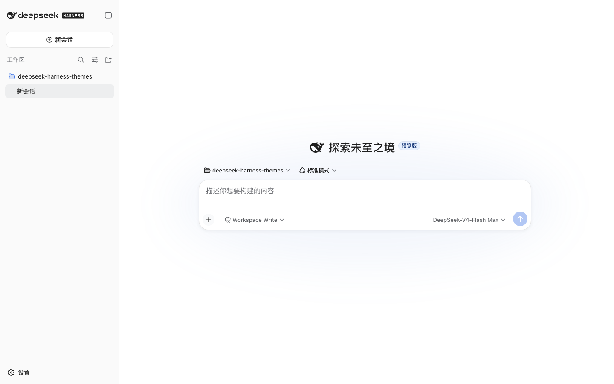

## OLED

Dark — true black for emissive panels, so unlit pixels stay unlit. Base `#000000`, brand `#ffffff`.

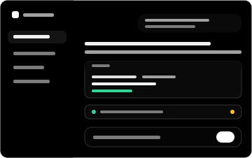

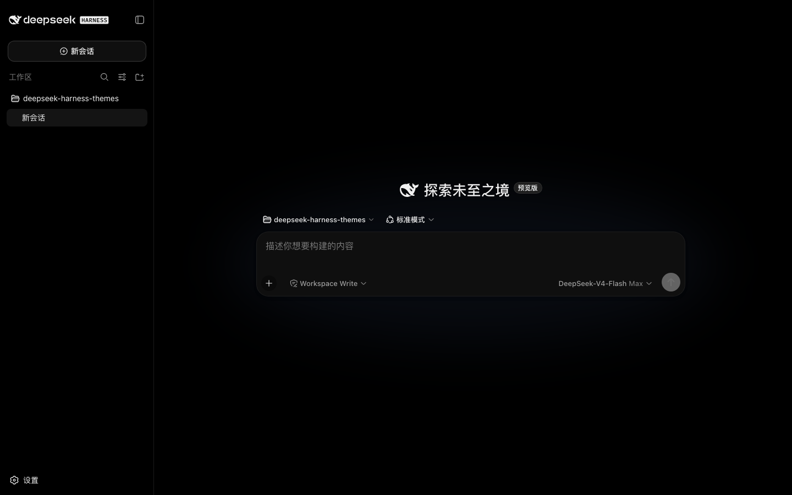

## Dracula

Dark — high-contrast purple over near-black indigo. Base `#282a36`, brand `#bd93f9`.

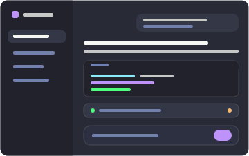

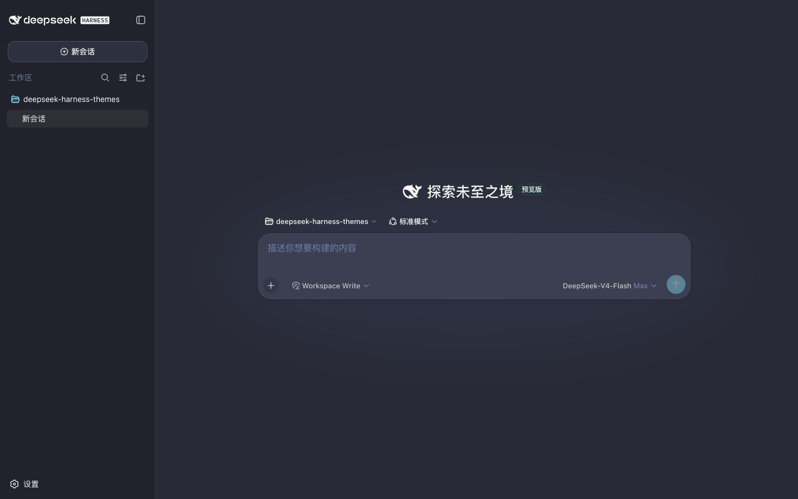

## Catppuccin

Dark — soft pastel (Mocha), muted mauve accents. Base `#1e1e2e`, brand `#cba6f7`.

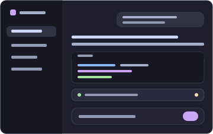

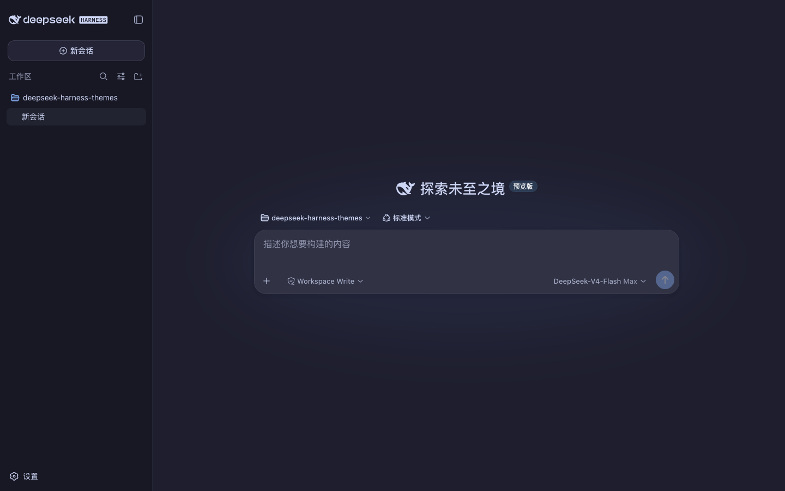

## Tokyo Night

Dark — midnight blue with neon accents. Base `#1a1b26`, brand `#7aa2f7`.

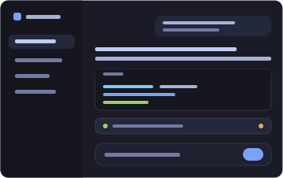

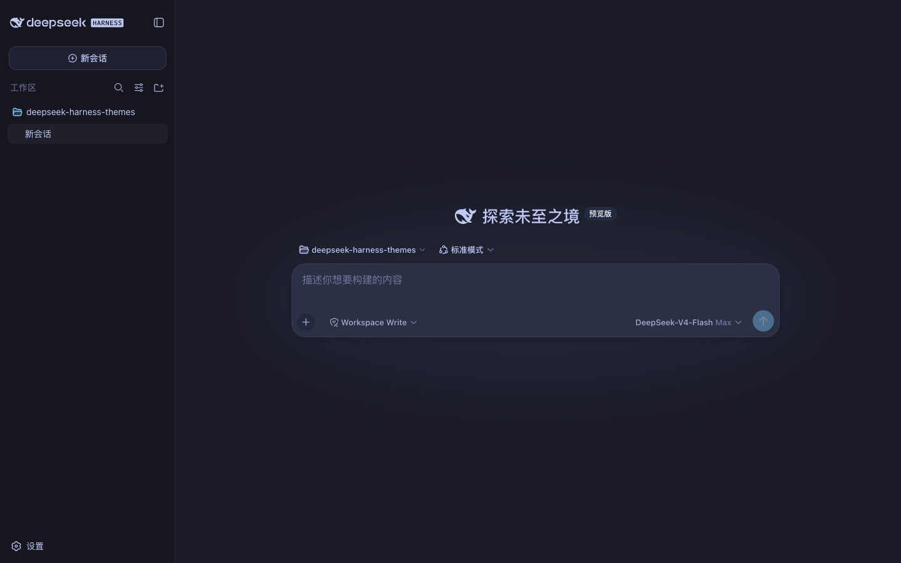

## GitHub Dark

Dark — the familiar GitHub interface. Base `#0d1117`, brand `#58a6ff`.

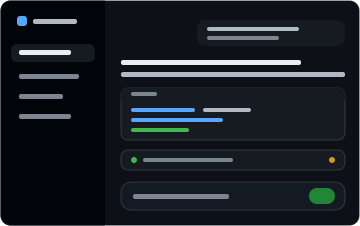

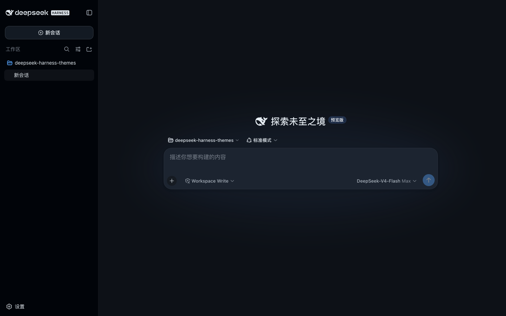

## Solarized

Dark — Solarized Dark's scientific palette: teal base03 surfaces, solarized yellow accent. Base `#002b36`, brand `#b58900`.

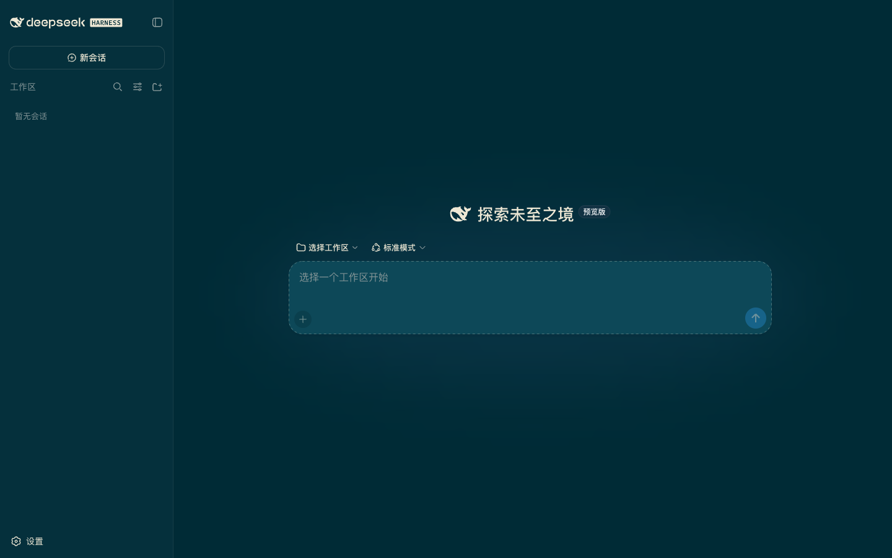

## Gruvbox

Dark — Gruvbox Dark's retro groove: warm neutral surfaces, bright orange accent. Base `#282828`, brand `#fe8019`.

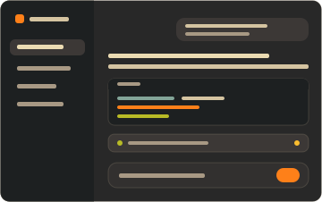

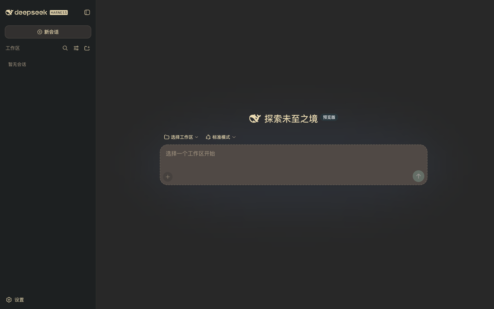

## Nord

Dark — Nord's arctic north-blues with frost accents. Base `#2e3440`, brand `#88c0d0`.

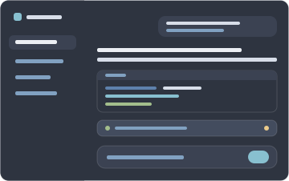

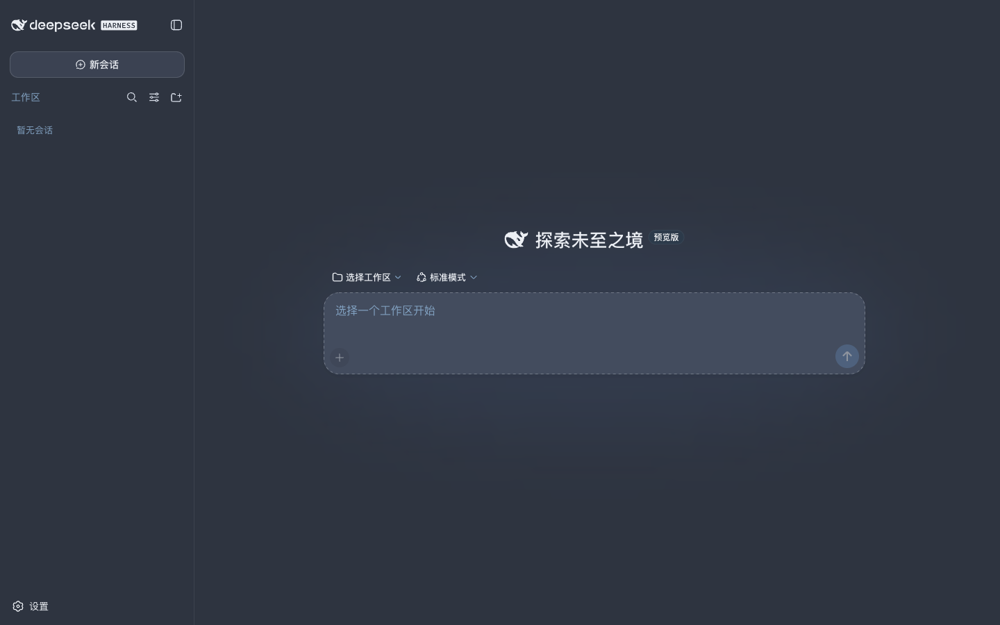

## Synthwave '84

Dark — neon pink and cyan over a deep violet night. Base `#241b2f`, brand `#ff7edb`.

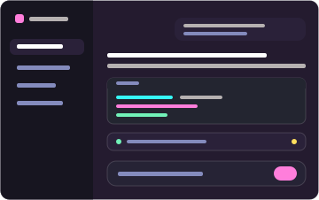

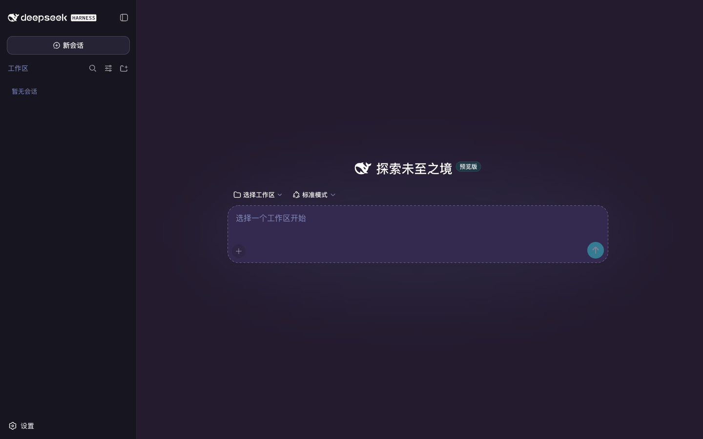

## Cobalt2

Dark — cobalt blue with Wes Bos's signature yellow. Base `#193549`, brand `#ffc600`.

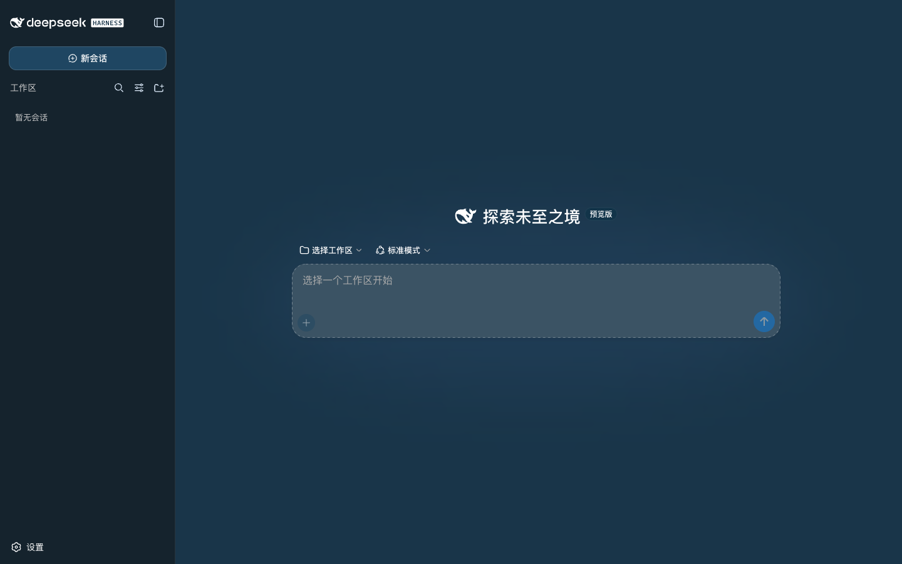

## Adding one

A new theme's preview is generated, never drawn: [creating a theme](creating-a-theme.md) covers the step. The two colours quoted above are `--dsw-alias-bg-base` and `--dsw-alias-brand-primary`, the same pair the settings-row swatch paints with.
